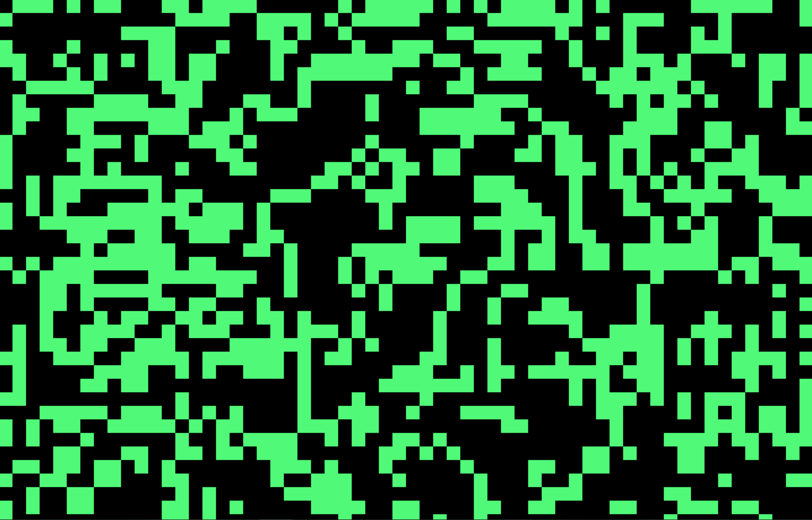

# Conway's Game of Life

### To build the project the following is needed to be done:

```
sudo apt-get install libfreetype-dev libfreetype6 libfreetype6-dev libxrandr-dev libxcursor-dev libudev-dev libopenal-dev libflac-dev libvorbis-dev libgl1-mesa-dev libegl1-mesa-dev libdrm-dev libgbm-dev
```

```
mkdir build && cd build && cmake -GNinja .. && ninja run_graphics
```

### There is a screenshot of 'Game of Life':
